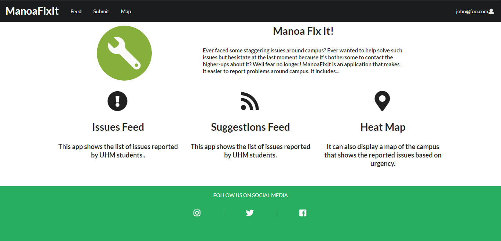
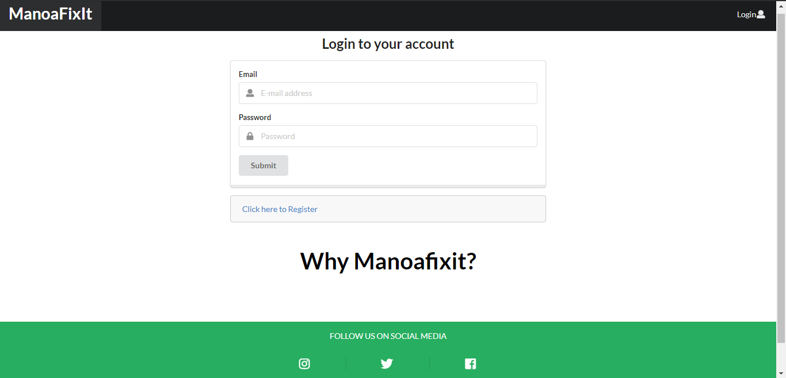
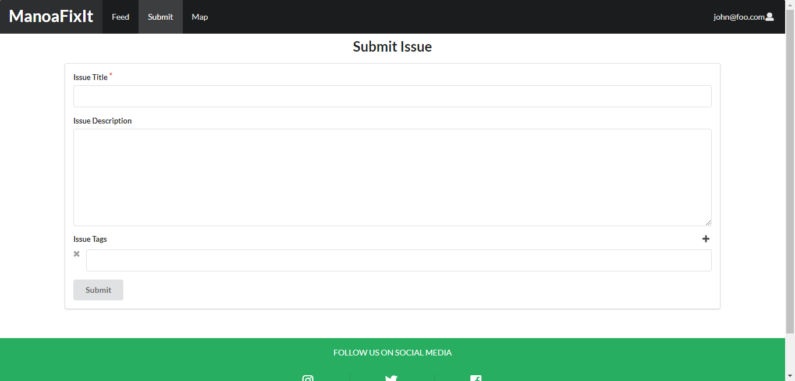
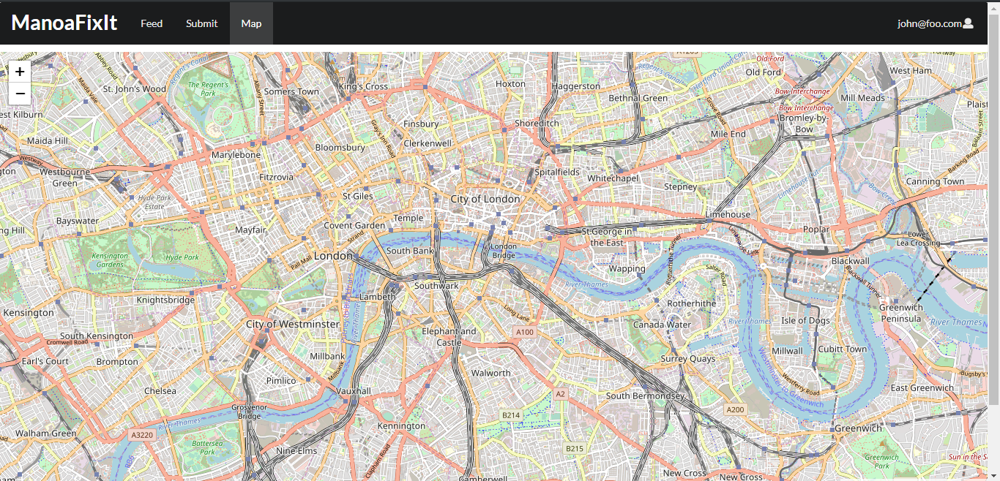

# Manoa Fix It

(click [here](http://manoafixit.meteorapp.com) to redirect to the app)
(click [here](https://github.com/manoafixit) to visit the Manoafixit github organization page)

## Goals of the project
* To create an app that serves a place where all people can address current issues around UHM Campus.
* Also to create place where people could give suggestions on how to improve certain aspects in UH Manoa.
* To showcase the skills the project creators have learned in ICS 314.

## What the System Provides
* A list of problems (sorted in order based on urgency) stated by the community.
* A list of suggestions (sorted in order based on agreement by other users) stated by the community.

## Overview
ManoaFixIt is a user-friendly application that enables all students around UH Manoa Campus to directly report any issues, such as a broken door knob that could potentially trap people inside a room, a dysfunctional toilet that does not flush which makes bathrooms unsanitary and unwelcoming, etc. It also enables students to post their suggestions on how to improve the campus itself. Once a student sumbits an issue, ManoaFixIt displays the issue on a feed where people can upvote it to increase its urgency. This way, the authorities would know which issue requires the most immediate attention, and they can also choose to accept or reject them.

## Milestones

[Milestone 1](https://github.com/manoafixit/manoafixit/projects/1) - Done

[Milestone 2](https://github.com/manoafixit/manoafixit/projects/2) - In Progress

[Milestone 3](https://github.com/manoafixit/manoafixit/projects/3) - In Progress

## User Guide

### Installation
* [Download the app](https://github.com/manoafixit/manoafixit). Remember to go to the **dev** branch and not the **master**.
* Open your shell in your computer.
* Type *meteor npm install*.
  * This would install the packages or tools in Node.js which are not included in the source code on GitHub.
* Next, type *meteor npm run start*.
  * This will initiliaze meteor, so you could run your app on *http://localhost:3000*

## Developer Guide

(click on image to redirect to particular page)

## Milestone 1

### Landing Page

This is where the user is redirected when not logged in. It contains simple descriptions of the app.

### Sign In Page

This is where the user (who is a UHM student) signs in.

### Submit Page (Need to Sign In)

This is where the user submits issues. Note that the user must put a title and description on the issue while tags are completely optional but are recommended because it eases feed navigation.

### Map Page

This is where the map of UHM campus which shows the location of the issues that were submitted on the application.

## Milestone 2

### Landing Page

### Submit Page

### Map Page

### Feed Page

## About us

### Adrian Au
* I want to learn how an actual software engineer operates with a group and what is needed to create a successful project. I hope to improve on my skills using GitHub and as well as with meteor. 
* All skills that I own have been obtained through this class and prior classes such as 111 and 211
* Unavailable on Saturday nights but mostly available all day Sunday (we could meet on sundays) 
* Discord is working fine my number is 808(753-2689) for more immediate notification because I don’t see discord unless I open it on my computer.

### Gian Calica
* Goal: To build a fully functional web application that a student from UHM would actually want to actively use and learn more software engineering practices.
* Skills (to bring and develop):
  * Back-end (Meteor and MongoDB)
  * Front-end (UX Design)
  * Project Management
   * Project Structure
   * Connecting back-end to front-end, vice-versa
   * Git & GitHub
   
### Graham Francisco
* To test my knowledge based on what we have learned so far in the semester and incorporate all of them into this final project. I want to learn how to complete a group project in a very efficient and systematic way and I would also like to improve my understanding of javascript, react and meteor.
* Like most of my classmates, I have acquired most of my skills in 111 and 211 ICS classes in which we extensively used Java. I will do my best to translate the skills I’ve learned in these classes into this project.
* I’m almost always available every night, except if there are two or more midterms within an upcoming week. If online, I’m virtually always available to meet with the group, and if it’s in person, only the weekends (preferably Saturday, but Sundays are ok).
* I prefer to be contacted on Discord since I always have it open at night and I have it on my phone. Texting would be my secondary preference as I would be notified as quickly as Discord, but my response time won’t be nearly as fast. Third, is through email, since my phone notifies me when I get new mails.
