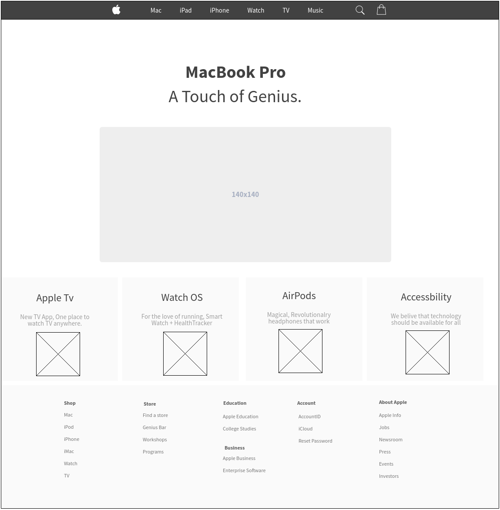
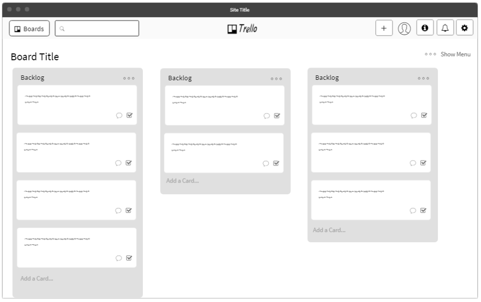

# Manoa Fix It

## Goals of the project:
* To create an app that serves a place where all people can address current issues around UHM Campus.
* Also to create place where people could give suggestions on how to improve certain aspects in UH Manoa.
* To showcase the skills the project creators have learned in ICS 314.

## What the System Provides:
* A list of problems (sorted in order based on urgency) stated by the community.
* A list of suggestions (sorted in order based on agreement by other users) stated by the community.

## Mockup Screenshots:

Similar webpages we plan to use for our application.

### Landing

This is where users will be redirected and where they will sign up or sign in.

### Lists

We could set up a tab for the problems and suggestions section

