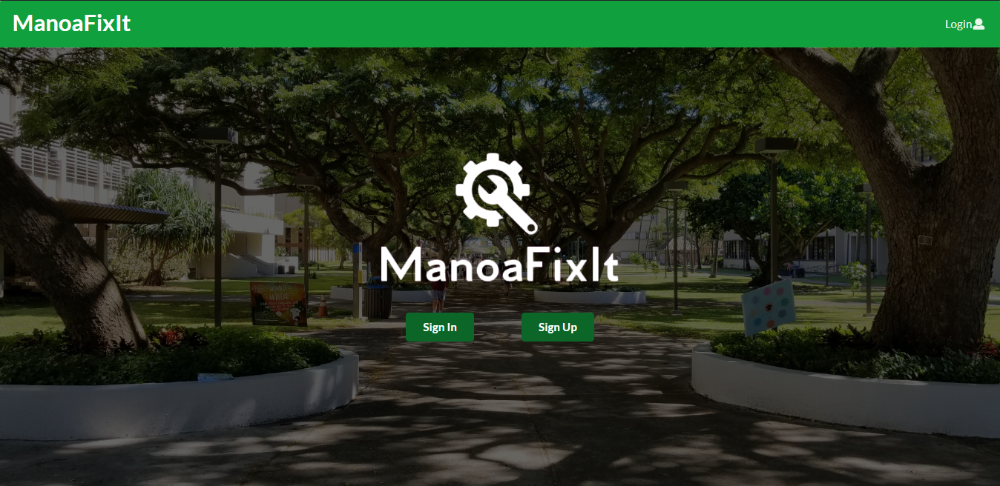

# Manoa Fix It

(click [here](http://manoafixit.meteorapp.com) to redirect to the app)
 
(click [here](https://github.com/manoafixit) to visit the Manoafixit github organization page)

## Table of Contents

* [Goals of the Project](#goals-of-the-project)
* [What the System Provides](#what-the-system-provides)
* [Overview](#overview)
* [Milestones](#milestones)
* [Development Timelapse](#development-timelapse)
* [User Guide](#user-guide)
* [Developer Guide](#developer-guide)
* [Community Feedback](#community-feedback)
* [About Us](#about-us)

## Goals of the Project
* To create an app that serves a place where all people can address current issues around UHM Campus.
* Also to create place where people could give suggestions on how to improve certain aspects in UH Manoa.
* To showcase the skills the project creators have learned in ICS 314.

## What the System Provides
* A list of problems (sorted in order based on urgency) stated by the community.
* A list of suggestions (sorted in order based on agreement by other users) stated by the community.

## Overview
ManoaFixIt is a user-friendly application that enables all students around UH Manoa Campus to directly report any issues, such as a broken door knob that could potentially trap people inside a room, a dysfunctional toilet that does not flush which makes bathrooms unsanitary and unwelcoming, etc. It also enables students to all issues reported by other students: once a student sumbits an issue, ManoaFixIt displays the issue on a feed where people can upvote it to increase its urgency. This way, the authorities would know which issue requires the most immediate attention, and they can also choose to accept or reject them.

## Milestones

### GitHub Project Pages

[Milestone 1](https://github.com/manoafixit/manoafixit/projects/1) - Done

[Milestone 2](https://github.com/manoafixit/manoafixit/projects/2) - Done

[Milestone 3](https://github.com/manoafixit/manoafixit/projects/3) - Tentatively Done

### Releases

To check all the release versions of the application click [here](https://github.com/manoafixit/manoafixit/releases). It will show details of the app's progress, starting from milestone one up to milestone three.

## Development Timelapse

## User Guide

### Installation
* [Download the app](https://github.com/manoafixit/manoafixit). Remember to go to the **dev** branch and not the **master**.
* Open your shell in your computer.
* Type *meteor npm install*.
  * This would install the packages or tools in Node.js which are not included in the source code on GitHub.
* Next, type *meteor npm run start*.
  * This will initiliaze meteor, so you could run your app on *http://localhost:3000*

## Developer Guide

(click on image to redirect to particular page; you should be logged in to have access to different pages)

### Landing Page

The landing page contains more information such as mobile snippets of the submit, feed, and issue page, and it also explains the purpose of the application and its qualities. Note that if you are not logged in, there will be two buttons that appear: sign in and sign out. Otherwise, if you are logged in, a button to submit an issue appears instead.

### Submit Page

The submit page allows you to submit issues that you find on campus. We added a text box reminder stating that our map will pinpoint your location more accurately when using a device with GPS like a phone versus a computer.

### Feed Page

The feed page displays all the issues that have been submitted by every student. It shows the status of the issue, tags associated by with it, the poster, the number of likes, and the date it was submitted.

#### Mobile Version

As you can see here, our feed page is viewable on mobile.

 

### Issue Page

When you click on an issue listed on the feed page, it takes you to the issue page where users can reply to an issue and read past replies.

#### Mobile Version

As you can see here, our issue page is viewable on mobile as well.

 

### Map Page

This page shows a map that pinpoints the location of each issue submitted. It will first request the user to allow the site to gain access to your geographical location. We updated the look of our markers for current issues, and also edited the color that these markers can take. There is a segment at the top of the map page showing the different markers and their statuses.

#### Mobile Version

 

The map page also works responsively on mobile. Notice that after submitting an issue, the map places a marker to the location of the submitted issue.

## Other components:

### Mobile Sidebar

When you are using a mobile device, a sidebar contains all the navigation bar buttons, instead of the navbar containing all the buttons itself.

  

### Footer

We changed the footer from social media icons to working links to each of our github profiles

#### Mobile Version

As you can see here, our footer is viewable on mobile as well.

  

### Community Feedback

#### Sam H.

* What features of our app did you like?
The simplicity and ease of the website. I enjoyed using a created username versus a legal name because we can speak freely and not worry about anonymity.
* What features of our app did you dislike?
Repitition of information on the home page. I wanted to be able to select where on the map our problems were relevant instead of where the incident was reported.
* What suggestions do you have to improve or add to our app?
Improve the location options as stated above.
* Would you actually use our app in your student life?
Yes
* From a scale of 1 to 10, how well did our app accomplish solving the problem it is trying to solve?
7
* From a scale of 1 to 10, what is the overall quality of our app?
8

#### Davin T.
* What features of our app did you like?
Dynamic map and a simple design.
* What features of our app did you dislike?
Some buttons do not work, repeat of some text.
* What suggestions do you have to improve or add to our app?
Perhaps a feature that allows issue submission without allowing location access.
* Would you actually use our app in your student life?
Yes
* From a scale of 1 to 10, how well did our app accomplish solving the problem it is trying to solve?
7
* From a scale of 1 to 10, what is the overall quality of our app?
8

#### Marty A.
* What features of our app did you like?
The background pictures featuring our campus were a nice touch.
* What features of our app did you dislike?
The homepage had a nice background but the other pages were plain.
* What suggestions do you have to improve or add to our app?
Backgrounds to all pages so it is more appealing
* Would you actually use our app in your student life?
Yes
* From a scale of 1 to 10, how well did our app accomplish solving the problem it is trying to solve?
10
* From a scale of 1 to 10, what is the overall quality of our app?
9

#### Ed Ryan B.
* What features of our app did you like?
I liked that there is a like counter next to the issues, it reminds me of reddit
* What features of our app did you dislike?
I initially blocked my location access and had to go through the steps of giving it permission.
* What suggestions do you have to improve or add to our app?
Add directions about giving location access on the homepage
* Would you actually use our app in your student life?
Yes
* From a scale of 1 to 10, how well did our app accomplish solving the problem it is trying to solve?
9
* From a scale of 1 to 10, what is the overall quality of our app?
6

#### Austin T.
* What features of our app did you like?
The map that shows issues that were submitted as well as its status
* What features of our app did you dislike?
Social media buttons don't work
* What suggestions do you have to improve or add to our app?
Fix your social media buttons
* Would you actually use our app in your student life?
Yes
* From a scale of 1 to 10, how well did our app accomplish solving the problem it is trying to solve?
8
* From a scale of 1 to 10, what is the overall quality of our app?
8

## About Us

### Adrian Au
* I want to learn how an actual software engineer operates with a group and what is needed to create a successful project. I hope to improve on my skills using GitHub and as well as with meteor.
* All skills that I own have been obtained through this class and prior classes such as 111 and 211
* Unavailable on Saturday nights but mostly available all day Sunday (we could meet on sundays)
* Discord is working fine my number is 808(753-2689) for more immediate notification because I don’t see discord unless I open it on my computer.

### Gian Calica
* Goal: To build a fully functional web application that a student from UHM would actually want to actively use and learn more software engineering practices.
* Skills (to bring and develop):
  * Back-end (Meteor and MongoDB)
  * Front-end (UX Design)
  * Project Management
   * Project Structure
   * Connecting back-end to front-end, vice-versa
   * Git & GitHub

### Graham Francisco
* To test my knowledge based on what we have learned so far in the semester and incorporate all of them into this final project. I want to learn how to complete a group project in a very efficient and systematic way and I would also like to improve my understanding of javascript, react and meteor.
* Like most of my classmates, I have acquired most of my skills in 111 and 211 ICS classes in which we extensively used Java. I will do my best to translate the skills I’ve learned in these classes into this project.
* I’m almost always available every night, except if there are two or more midterms within an upcoming week. If online, I’m virtually always available to meet with the group, and if it’s in person, only the weekends (preferably Saturday, but Sundays are ok).
* I prefer to be contacted on Discord since I always have it open at night and I have it on my phone. Texting would be my secondary preference as I would be notified as quickly as Discord, but my response time won’t be nearly as fast. Third, is through email, since my phone notifies me when I get new mails.
