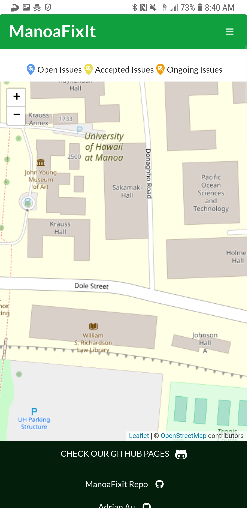
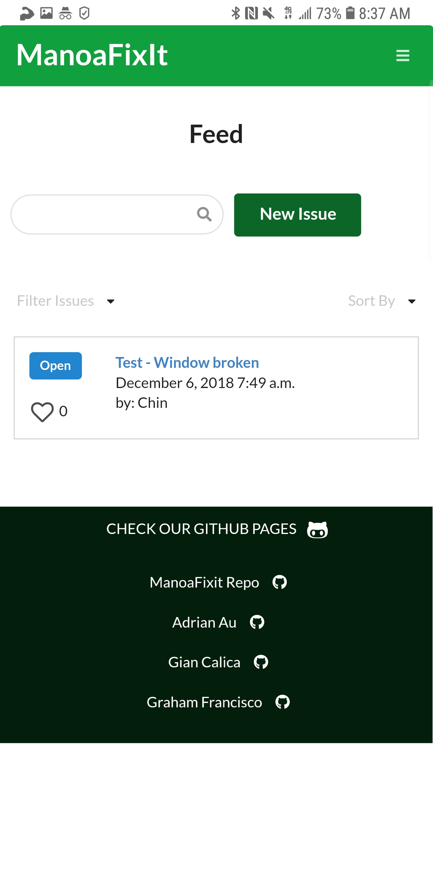
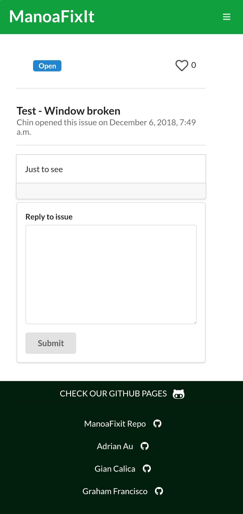

# Manoa Fix It

(click [here](http://manoafixit.meteorapp.com) to redirect to the app)
(click [here](https://github.com/manoafixit) to visit the Manoafixit github organization page)

## Goals of the project
* To create an app that serves a place where all people can address current issues around UHM Campus.
* Also to create place where people could give suggestions on how to improve certain aspects in UH Manoa.
* To showcase the skills the project creators have learned in ICS 314.

## What the System Provides
* A list of problems (sorted in order based on urgency) stated by the community.
* A list of suggestions (sorted in order based on agreement by other users) stated by the community.

## Overview
ManoaFixIt is a user-friendly application that enables all students around UH Manoa Campus to directly report any issues, such as a broken door knob that could potentially trap people inside a room, a dysfunctional toilet that does not flush which makes bathrooms unsanitary and unwelcoming, etc. It also enables students to post their suggestions on how to improve the campus itself. Once a student sumbits an issue, ManoaFixIt displays the issue on a feed where people can upvote it to increase its urgency. This way, the authorities would know which issue requires the most immediate attention, and they can also choose to accept or reject them.

## Milestones

[Milestone 1](https://github.com/manoafixit/manoafixit/projects/1) - Done

[Milestone 2](https://github.com/manoafixit/manoafixit/projects/2) - Done

[Milestone 3](https://github.com/manoafixit/manoafixit/projects/3) - In Progress

## User Guide

### Installation
* [Download the app](https://github.com/manoafixit/manoafixit). Remember to go to the **dev** branch and not the **master**.
* Open your shell in your computer.
* Type *meteor npm install*.
  * This would install the packages or tools in Node.js which are not included in the source code on GitHub.
* Next, type *meteor npm run start*.
  * This will initiliaze meteor, so you could run your app on *http://localhost:3000*

## Developer Guide

(click on image to redirect to particular page)
(you should be logged in to have access to different pages)

## Milestone 1 - Outdated

### Landing Page

This is where the user is redirected when not logged in. It contains simple descriptions of the app.

### Sign In Page

This is where the user (who is a UHM student) signs in.

### Submit Page (Need to Sign In)

This is where the user submits issues. Note that the user must put a title and description on the issue while tags are completely optional but are recommended because it eases feed navigation.

### Map Page

This is where the map of UHM campus which shows the location of the issues that were submitted on the application.

## Milestone 2 - Completed

### Landing Page

This is the landing page a user will first see when not logged in.

After creating an account or signing in, the user will now have access to the navigation bar at the top with different features.

#### Mobile Version
The landing page is also made responsive with mobile devices.

 

In the mobile version of the app, notice that when logged in, a sidebar button is implemented in the navbar, showing options for the Feed, Submit, Map Pages as well as the option to sign out.

 

### Submit Page

Not much has changed in the submit page ui, except now it asks for permission from the user to give their location. If they do so, the location in which they submitted the issue will be marked on the map page.

When initially redirecting to the submit page, the website should automatically ask for your permission to your location (we need this for you to use our application). 

If the permission prompt does not show, or if you accidentally denied permission and it does not appear again, follow these instructions for whichever device and browser you are using to grant location access for our application.

#### Mobile Version
Submitting an issue on mobile is fairly easy and responsive.

 

The mobile and desktop version look the same, but since it is possible to do it on mobile, it is far more efficient than having to bring your laptop just to report an issue.

### Map Page

Here is our map page which has an active map over the University of Hawaii at Manoa campus. Here you can see locations where past issues have been submitted, details about that issue, and the issue's status.

#### Mobile Version

 

The map page also works responsively on mobile. Notice that after submitting an issue, the map places a marker to the location of the submitted issue.

 

Clicking on the marker would display the title and tags of the issue, the date it was submitted, as well as a link to a separate page for the particular issue (To be implemented on Milestone 3).

### Feed Page

This is our feed page which shows a list of submitted issues, tags and details about the issue, and also who and when the issue was submitted by.

#### Mobile Version

The feed page on mobile works but is not responsive; the table gets distorted.

## Milestone 3 - Currently Deployed

### Submit Page

For our submit page we added a text box reminder at the bottom stating that our map will pinpoint your location more accurately when using a device with GPS like a phone versus a computer. 

### Map Page

For milestone 3 we updated the look of our markers for current issues, and also edited the color that these markers can take. There is a segment at the top of the map page showing the different markers and their statuses.

#### Mobile Version

 

The map page also works responsively on mobile. Notice that after submitting an issue, the map places a marker to the location of the submitted issue.

### Feed Page

For milestone 3 we implemented a like counter to our issues which shows the number of likes from other users on an issue. We better formatted the display of tags and statuses.

#### Mobile Version

As you can see here, our feed page is viewable on mobile.

 

### Footer

We changed the footer from social media icons to working links to each of our github profiles

#### Mobile Version

As you can see here, our footer is viewable on mobile as well.

 

### Issue Page

When you click on an issue listed on the feed page, it takes you to the issue page where users can reply to an issue and read past replies.

#### Mobile Version

As you can see here, our issue page is viewable on mobile as well.

 

#### Mobile sidebar

We also changed the look of our sidebar when viewing on mobile

  

### Community Feedback

#### Sam H.

* What features of our app did you like? 
The simplicity and ease of the website. I enjoyed using a created username versus a legal name because we can speak freely and not worry about anonymity.
* What features of our app did you dislike?
Repitition of information on the home page. I wanted to be able to select where on the map our problems were relevant instead of where the incident was reported.
* What suggestions do you have to improve or add to our app?
Improve the location options as stated above.
* Would you actually use our app in your student life?
Yes
* From a scale of 1 to 10, how well did our app accomplish solving the problem it is trying to solve? 
7
* From a scale of 1 to 10, what is the overall quality of our app?
8

#### Davin T.
* What features of our app did you like? 
Dynamic map and a simple design. 
* What features of our app did you dislike?
Some buttons do not work, repeat of some text.
* What suggestions do you have to improve or add to our app?
Perhaps a feature that allows issue submission without allowing location access.
* Would you actually use our app in your student life?
Yes
* From a scale of 1 to 10, how well did our app accomplish solving the problem it is trying to solve?
7
* From a scale of 1 to 10, what is the overall quality of our app?
8

#### Marty A.
* What features of our app did you like? 
The background pictures featuring our campus were a nice touch.
* What features of our app did you dislike?
The homepage had a nice background but the other pages were plain. 
* What suggestions do you have to improve or add to our app?
Backgrounds to all pages so it is more appealing
* Would you actually use our app in your student life?
Yes
* From a scale of 1 to 10, how well did our app accomplish solving the problem it is trying to solve? 
10
* From a scale of 1 to 10, what is the overall quality of our app?
9

#### Ed Ryan B.
* What features of our app did you like? 
I liked that there is a like counter next to the issues, it reminds me of reddit
* What features of our app did you dislike?
I initially blocked my location access and had to go through the steps of giving it permission. 
* What suggestions do you have to improve or add to our app?
Add directions about giving location access on the homepage
* Would you actually use our app in your student life?
Yes
* From a scale of 1 to 10, how well did our app accomplish solving the problem it is trying to solve? 
9
* From a scale of 1 to 10, what is the overall quality of our app?
6

#### Austin T.
* What features of our app did you like?
The map that shows issues that were submitted as well as its status
* What features of our app did you dislike?
Social media buttons don't work
* What suggestions do you have to improve or add to our app?
Fix your social media buttons
* Would you actually use our app in your student life?
Yes
* From a scale of 1 to 10, how well did our app accomplish solving the problem it is trying to solve? 
8
* From a scale of 1 to 10, what is the overall quality of our app?
8

## About us

### Adrian Au
* I want to learn how an actual software engineer operates with a group and what is needed to create a successful project. I hope to improve on my skills using GitHub and as well as with meteor. 
* All skills that I own have been obtained through this class and prior classes such as 111 and 211
* Unavailable on Saturday nights but mostly available all day Sunday (we could meet on sundays) 
* Discord is working fine my number is 808(753-2689) for more immediate notification because I don’t see discord unless I open it on my computer.

### Gian Calica
* Goal: To build a fully functional web application that a student from UHM would actually want to actively use and learn more software engineering practices.
* Skills (to bring and develop):
  * Back-end (Meteor and MongoDB)
  * Front-end (UX Design)
  * Project Management
   * Project Structure
   * Connecting back-end to front-end, vice-versa
   * Git & GitHub
   
### Graham Francisco
* To test my knowledge based on what we have learned so far in the semester and incorporate all of them into this final project. I want to learn how to complete a group project in a very efficient and systematic way and I would also like to improve my understanding of javascript, react and meteor.
* Like most of my classmates, I have acquired most of my skills in 111 and 211 ICS classes in which we extensively used Java. I will do my best to translate the skills I’ve learned in these classes into this project.
* I’m almost always available every night, except if there are two or more midterms within an upcoming week. If online, I’m virtually always available to meet with the group, and if it’s in person, only the weekends (preferably Saturday, but Sundays are ok).
* I prefer to be contacted on Discord since I always have it open at night and I have it on my phone. Texting would be my secondary preference as I would be notified as quickly as Discord, but my response time won’t be nearly as fast. Third, is through email, since my phone notifies me when I get new mails.
